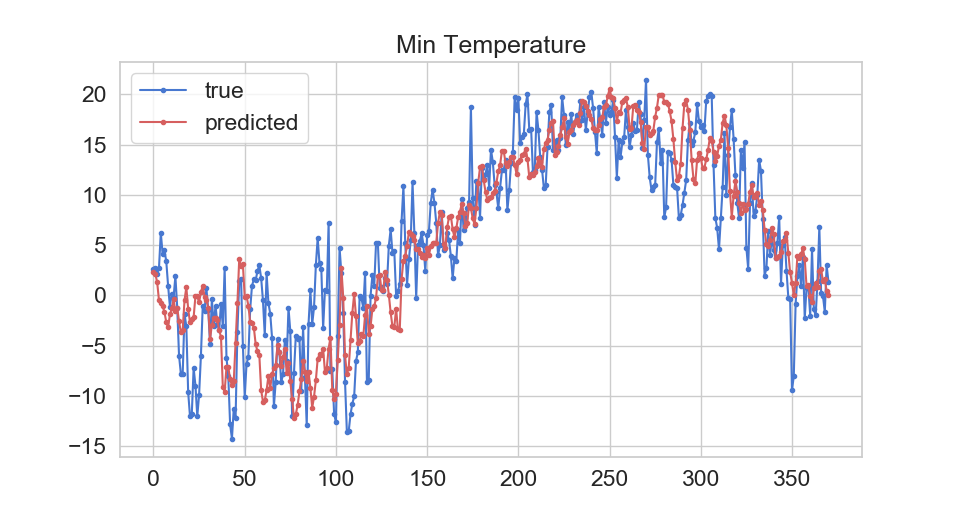

# Weather-prediction
Weather prediction is done on historical time series data. The dataset includes hourly inputs of pressure, humidity, temperature, wind speed and wind direction of 36 cities from the year 2012 to 2017. From the dataset preprocessing is done to engineer attributes to predict min and max temperature of Toronto. Data from 2012-2016 was used as the training dataset while the attempt was to predict the min and max temp of 2017.
 
• Tensorflow 2.0 is used. 
• Bidirectional LSTM is used to train the model. 
• Performance for the maximum temperature prediction is R2: 0.78, MAE:0.21, MSE: 0.07 and for the minimum temperature prediction is R2:0.74, MAE: 0.22, MSE: 0.08
 

# Preprocessing 
The data and the attributes for the city Toronto is prepared using get_toronto_data.py script.

# Average Temperature Yearly 

# Average Temperature Monthly

# Prediction for Minimum Temperature

# Prediction for Maximum Temperature

# How to run
check weather_prediction_maxTemp.py and weather_prediction_minTemp.py
